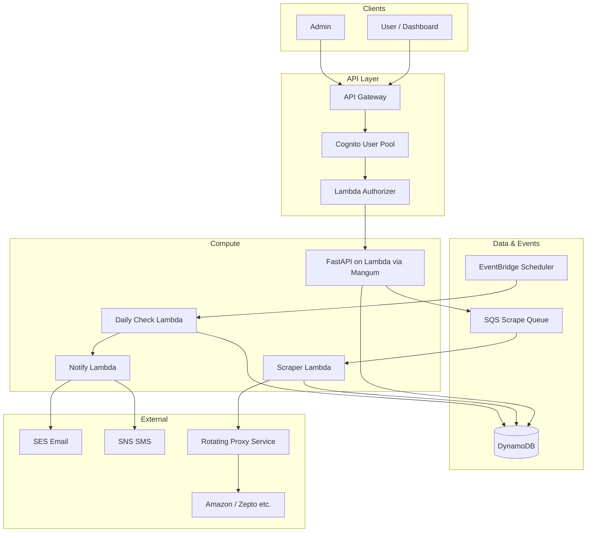

# Scrapestore: FastAPI + AWS CRUD Scraping App — Plan & Resources

## Architecture Overview




---

## 1. Tech Stack Summary


| Layer         | Choice                                                                                              | Purpose                                                          |
| ------------- | --------------------------------------------------------------------------------------------------- | ---------------------------------------------------------------- |
| Backend       | **FastAPI only**                                                                                    | All REST/CRUD and business logic                                 |
| Hosting       | **AWS Lambda**                                                                                      | Run FastAPI via Mangum (ASGI adapter)                            |
| API           | **API Gateway HTTP API**                                                                            | REST endpoints + WebSocket later if needed for live dashboard    |
| Auth          | **Amazon Cognito**                                                                                  | User pool + JWT; API Gateway authorizer (Cognito or Lambda)      |
| DB            | **DynamoDB**                                                                                        | Users, scrapes, products, admin logs; single-table or 2–3 tables |
| Queue         | **SQS**                                                                                             | Async scrape jobs so API returns quickly                         |
| Scheduler     | **EventBridge (Scheduler)**                                                                         | Daily “did user scrape?” check                                   |
| Notifications | **SES (email)** + **SNS (SMS)**                                                                     | Missed-scrape alerts                                             |
| Proxies       | **Third-party rotating proxy** (e.g. Bright Data, Oxylabs) or **AWS-based** (e.g. Lambda + gateway) | Safer scraping; store API key in Secrets Manager                 |


---

## 2. AWS Services Checklist

- **Lambda**: FastAPI handler (Mangum), Scraper worker, Notify (SES/SNS), Daily-check (EventBridge), optional Lambda Authorizer.
- **API Gateway**: HTTP API, Cognito authorizer (or Lambda authorizer) for token-based access.
- **Cognito**: User pool (sign up/in), app client, JWT access/ID tokens for “limited users.”
- **DynamoDB**: Tables for users, scrapes, product records, admin audit/scrape logs.
- **SQS**: Queue for scrape requests (user_id, source, params); Scraper Lambda consumes.
- **EventBridge Scheduler**: One schedule (e.g. daily 8 PM) to trigger Daily-check Lambda.
- **SES**: Verify domain/address; send “you missed scraping” emails.
- **SNS**: SMS for missed-scrape (optional); topic or direct publish from Notify Lambda.
- **Secrets Manager**: Store proxy API keys and any site credentials.
- **IAM**: Roles for Lambda (DynamoDB, SQS, SNS, SES, Secrets Manager), API Gateway invoking Lambda.
- **CloudWatch**: Logs and metrics for monitoring and admin “smooth scraping” visibility.

---

## 3. FastAPI Backend Structure (Backend Only)

Keep the repo focused on the **backend**; dashboard can be a separate frontend that calls this API.

Suggested layout:

```
scrapstore/
├── app/
│   ├── main.py              # FastAPI app, Mangum handler
│   ├── config.py            # Env (table names, queue URL, etc.)
│   ├── auth.py              # Cognito JWT validation / dependency
│   ├── models/              # Pydantic request/response
│   ├── routers/
│   │   ├── users.py         # CRUD user profile (linked to Cognito sub)
│   │   ├── scrapes.py       # CRUD: create/list/get scrapes, trigger job
│   │   ├── products.py      # List/get product data for a user
│   │   └── admin.py         # Admin: daily stats, logs, “alive” users (protected by role)
│   ├── services/
│   │   ├── dynamodb.py      # DynamoDB client and table access
│   │   ├── sqs.py           # Enqueue scrape job
│   │   └── cognito.py       # Optional: get user by sub, groups
│   └── scrapers/            # Optional in API repo; or in Scraper Lambda
│       └── (schemas for structured product data)
├── scraper_lambda/          # Separate Lambda: pull from SQS, scrape, write DDB
│   ├── handler.py
│   └── scrapers/
│       ├── base.py
│       ├── amazon_grocery.py
│       └── zepto.py
├── infrastructure/          # CDK or SAM
│   └── (Lambda, API GW, DynamoDB, SQS, EventBridge, etc.)
├── requirements.txt
└── README.md
```

- **CRUD**: Implement full create/read/update/delete for **scrape jobs** and **user-scoped product/result** resources; “user” record can be create/read/update only (created on first login via Cognito).
- **Token-based auth**: Every protected route uses a dependency that validates the Cognito JWT (from `Authorization: Bearer <token>`) and optionally checks a custom “admin” group for `/admin` routes.
- **Structured data**: Define clear Pydantic models and DynamoDB item shapes for products (e.g. name, price, quantity, category, source, scraped_at) so data is **structured and queryable** for future analysis; avoid free-form blobs.

---

## 4. DynamoDB Design (Structured & Empty-Ready for Analysis)

- **User-scoped data**: Partition key `PK = USER#<user_id>` (Cognito sub), sort key `SK = SCRAPE#<timestamp>` or `PRODUCT#<id>` so each user sees only their scraped data (“account connected to DynamoDB” = app reads/writes via backend with user’s token).
- **Admin / daily view**: Use a GSI with `GSI1PK = DATE#<YYYY-MM-DD>`, `GSI1SK = SCRAPE#<...>` (and similar for logs) so admin can query “all scrapes/logs for a given day.”
- **Access patterns to support**:
  - Get user profile: `PK = USER#<id>`, `SK = PROFILE`.
  - List user’s scrapes: `PK = USER#<id>`, `SK begins_with SCRAPE#`.
  - Get scrape results (products): `PK = USER#<id>`, `SK begins_with PRODUCT#<scrape_id>` or store products as a list in the scrape item.
  - Admin: “Scrapes and records for date D”: query GSI1 by `DATE#D`.
- Keep item sizes reasonable; store one product per item or batch in a list depending on query needs. Use consistent attribute names (e.g. `source`, `scraped_at`, `price`, `currency`) so future analytics (e.g. Athena/Glue or export to S3) stay simple.

---

## 5. Token-Based Authentication (AWS Only)

- **Cognito User Pool**: Create pool with email (or username) and password; enable JWT (access + ID token).
- **Limited users**: Use Cognito groups (e.g. `scraper_user`, `admin`). Only users in `scraper_user` (or no “banned” group) can call scrape/product endpoints; `admin` can call `/admin/`*.
- **API Gateway**: Attach a **Cognito User Pool authorizer** (or **Lambda authorizer** that validates Cognito JWKS). Validate token on all routes except `/health` and `/login` (Cognito hosted UI or token endpoint).
- **FastAPI**: In `auth.py`, decode JWT (using Cognito JWKS), verify signature and expiry, extract `sub` (user id) and optional `cognito:groups`; inject into `Depends()` so routes get current user and role. Admin routes require `admin` group.

---

## 6. Scraping: Safety, Proxies, and Structure

- **Rotating proxies**: Use a provider (Bright Data, Oxylabs, Smartproxy, etc.) that offers rotating residential or datacenter proxies; call their HTTP gateway from the **Scraper Lambda** with API key from Secrets Manager. Alternative: use an AWS-oriented approach (e.g. Lambda in VPC + NAT Gateway rotation or a dedicated proxy service that supports AWS).
- **Respect robots.txt and ToS**: Plan for grocery sites (Amazon, Zepto) to have strict ToS; use scraping only in line with your internship/learning scope and consider using official APIs where available (e.g. Amazon Product Advertising API for some product data).
- **Structured output**: Each scraper (e.g. `amazon_grocery`, `zepto`) should return a **fixed schema**: product name, price, quantity/unit, category, URL, image URL, scraped_at, source. Store this in DynamoDB so it’s “empty” (normalized) and ready for future analysis (e.g. price trends, availability).
- **Scraper Lambda**: Triggered by SQS; receives message (user_id, source, optional query/category); uses proxy client; runs appropriate scraper; writes to DynamoDB under `USER#<user_id>` and updates scrape status; on failure, write error record and optionally notify.

---

## 7. Dashboard and “Live” Updates

- **Backend**: Expose FastAPI endpoints:
  - `GET /scrapes/active` or `GET /admin/active-users`: Returns list of “currently running” or “recently completed” scrape jobs (e.g. last 5–15 minutes). Store “scrape status” (pending/running/done/failed) and `started_at`/`finished_at` in DynamoDB so admin and user can see “who is scraping.”
  - `GET /scrapes` (user) and `GET /admin/daily-stats?date=YYYY-MM-DD` (admin): List scrapes and, for admin, aggregates for the day.
- **Frontend**: A simple dashboard (React/Vue/Next.js or even a static S3 + CloudFront page) that:
  - Calls FastAPI (with Cognito token) to show the user’s scraped data and live status.
  - For admin: shows daily stats, list of scrapes, and “alive” users (recent activity). Can poll every 30–60 seconds or use WebSocket later (API Gateway WebSocket + Lambda).

---

## 8. Admin: Daily Records and Smooth Scraping

- **Admin-only routes** (e.g. under `/admin`), protected by Cognito group `admin`:
  - `GET /admin/daily?date=YYYY-MM-DD`: Count and list of scrapes, success/failure, sources.
  - `GET /admin/logs` or `/admin/audit`: Query DynamoDB (or CloudWatch Logs Insights) for scrape logs and errors.
- **EventBridge**: Daily schedule (e.g. 8 PM) triggers **Daily-check Lambda** that:
  - Scans or queries users who had “expected” scrape (e.g. users with a schedule) or simply “users who didn’t scrape today.”
  - For each such user, enqueue a “reminder” or call **Notify Lambda** with user_id and channel (email/SMS).
- **Notify Lambda**: Reads user contact (email/phone from DynamoDB or Cognito), sends email via **SES** and/or SMS via **SNS** with a “you missed scraping today” message.

---

## 9. User “Connected to DynamoDB” and Notifications

- **Connection to DynamoDB**: Users don’t connect to DynamoDB directly. The **backend** (FastAPI on Lambda) uses IAM to read/write DynamoDB; users authenticate with Cognito and only see their own data via API. So “ensure his account is connected to DynamoDB” = ensure the app uses the same Cognito identity for all requests and stores/retrieves by `USER#<sub>`.
- **Notifications**: If user misses a scrape (defined by your rule: e.g. no scrape in last 24h), EventBridge → Daily-check Lambda → Notify Lambda → **SES** (email) and/or **SNS** (SMS). Store user email/phone in DynamoDB profile or read from Cognito attributes.

---

## 10. Deployment (FastAPI on Lambda)

- Use **Mangum**: `handler = Mangum(app, lifespan="off")` (or with lifespan if you need startup logic; ensure cold starts are acceptable).
- Package FastAPI app and dependencies (e.g. with Lambda layer or container image); point API Gateway HTTP API to this Lambda.
- Infrastructure as Code: **AWS CDK** (Python) or **SAM** to define Lambda, API Gateway, DynamoDB, SQS, EventBridge, Cognito, IAM, and optional Secrets Manager. This keeps the project reproducible and professional for an internship.

---

## 11. Resources and References

- **FastAPI on Lambda**: [Mangum](https://github.com/kludex/mangum) — `pip install mangum`; handler = `Mangum(app)`.
- **Cognito + API Gateway**: [Integrate REST API with Cognito user pool](https://docs.aws.amazon.com/apigateway/latest/developerguide/apigateway-enable-cognito-user-pool.html); [Lambda authorizer](https://docs.aws.amazon.com/apigateway/latest/developerguide/apigateway-use-lambda-authorizer.html) if you need custom claims.
- **DynamoDB**: [Single-table design](https://docs.aws.amazon.com/amazondynamodb/latest/developerguide/bp-partition-key-design.html); [Data modeling](https://docs.aws.amazon.com/amazondynamodb/latest/developerguide/data-modeling-blocks.html).
- **SQS + Lambda**: [Lambda SQS trigger](https://docs.aws.amazon.com/lambda/latest/dg/with-sqs.html).
- **EventBridge Scheduler**: [Invoke Lambda on a schedule](https://docs.aws.amazon.com/lambda/latest/dg/with-eventbridge-scheduler.html).
- **SES**: [Send email](https://docs.aws.amazon.com/ses/latest/dg/send-email.html); **SNS**: [SMS](https://docs.aws.amazon.com/sns/latest/dg/sms_preferences.html).
- **Proxies**: Use a well-known provider (e.g. Bright Data, Oxylabs) and store credentials in **Secrets Manager**; rotate and restrict IAM to least privilege.

---

## 12. Internship Project Rating and Scope

**Rating: Strong internship-level project (roughly 7.5/10)**

- **Strengths**: Multiple AWS services (Lambda, DynamoDB, API Gateway, Cognito, SQS, EventBridge, SES/SNS), clear separation of API vs scraper vs notifications, token-based auth, structured data model, and IaC (CDK/SAM) show good cloud and backend skills. Admin and “live” dashboard add product sense.
- **Scope**: Building the full pipeline (API + scraper + notifications + dashboard + infra) is a substantial 4–8 week project; you can phase it (e.g. Week 1–2: FastAPI + DynamoDB + Cognito; Week 3: Scraper Lambda + SQS; Week 4: Notifications + EventBridge; Week 5: Admin + dashboard).
- **Risks**: Scraping commercial sites (Amazon, Zepto) can violate ToS and get IPs blocked; using rotating proxies and rate limiting is necessary. Prefer official APIs where possible and document assumptions.
- **Differentiators**: Single-table (or minimal-table) DynamoDB design, admin daily view, and missed-scrape notifications make the project stand out and show end-to-end thinking.

---

## Suggested Implementation Order

1. **Infrastructure (CDK/SAM)**: DynamoDB tables, Cognito user pool, Lambda (FastAPI + Mangum), API Gateway, IAM.
2. **FastAPI**: Health, auth dependency (Cognito JWT), user CRUD, scrape CRUD (create enqueues to SQS).
3. **Scraper Lambda**: SQS consumer, one stub scraper (e.g. mock or one allowed site), write structured results to DynamoDB; then add proxy and real sites carefully.
4. **Admin routes**: Daily stats and logs; secure with Cognito group.
5. **EventBridge + Daily-check + Notify Lambda**: SES (and optionally SNS) for missed-scrape alerts.
6. **Dashboard**: Simple frontend calling FastAPI for “live” and historical data; admin view for daily records and active users.

This plan gives you everything needed to build Scrapestore with FastAPI and AWS-only features, structured data, limited-user token auth, safer scraping with proxies, and admin visibility with notifications.